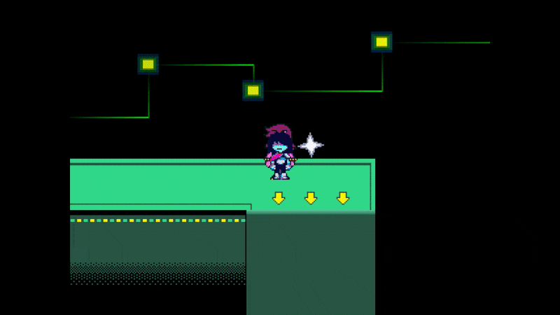

# `scr_armorinfo`
This is one giant code file that stores information regarding all the Dark World armors in the game.

If you want to add new/modify existing armors - `scr_armorinfo` is where you want to be.

# Item Indexes
Every item in DELTARUNE, whether it'd be a weapon, armor, or key item, all have their own predefined numeric index.

One thing that is common across *all* item registries is that index `0` is always reserved for nothing.

Here's a list of *some* armor indexes as an example.

- `1 (Amber Card)`
- `2 (Dice Brace)`
- `3 (Pink Ribbon)`

# Structure of a armor in `scr_armorinfo`

All armors have their own `case` in `scr_armorinfo`.
Each `case` is reserved for an item index. (Including `0`, which is nothing.)

All `case`s contain all the necessary armorn information for an individual armor, ATK, DEF, MAG, Sell value, etc... 

Here is a *(heavily commented)* code snippet of a armor (Amber Card) in `scr_armorinfo`

*Code taken from Chapter 2*

```gml
// Armor index 1, which is reserved for Amber Card.
case 1:
    // Name of the armor
    armornametemp = stringsetloc("Amber Card", "scr_armorinfo_slash_scr_armorinfo_gml_28_0");
    // Description of the armor
    armordesctemp = stringsetloc("A thin square charm that sticks#to you, increasing defense."
    "scr_armorinfo_slash_scr_armorinfo_gml_29_0");
    // Message if you try to equip on Susie
    amessage2temp = stringsetloc("... better than nothing.", "scr_armorinfo_slash_scr_armorinfo_gml_30_0");
    // Message if you try to equip on Ralsei
    amessage3temp = stringsetloc("It's sticky, huh, Kris...", "scr_armorinfo_slash_scr_armorinfo_gml_31_0");
    // Message if you try to equip on Noelle
    amessage4temp = stringsetloc("It's like a name-tag!", "scr_armorinfo_slash_scr_armorinfo_gml_33_0");
    // Armor ATK
    armorattemp = 0;
    // Armor DEF
    armordftemp = 1;
    // Armor MAG
    armormagtemp = 0;
    // Unused, this would've increased the amount of attack bolts while 
    // using the armor, similiar to the Burnt Pan in UNDERTALE.
    armorboltstemp = 0;
    // Unused, would've increased TP from grazing if implemented.
    // Instead, this is implemented manually in obj_grazebox_Create_0 for some reason.
    armorgrazeamttemp = 0;
    // Unused, would've increased Graze Size if implemented.
    // Instead, this is implemented manually in obj_grazebox_Create_0 for some reason.
    armorgrazesizetemp = 0;
    // If Kris can equip the armor
    armorchar1temp = 1;
    // If Susie can equip the armor
    armorchar2temp = 1;
    // If Ralsei can equip the armor
    armorchar3temp = 1;
    // NOTE: not in the original chapter2 code, but you can define 
    // if Noelle can equip the armor like this
    // armorchar4temp = 0;
    // Display text for the armor ability
    // a string with a single space " " means no ability.
    armorabilitytemp = stringsetloc(" ", "scr_armorinfo_slash_scr_armorinfo_gml_43_0");
    // Also an image_index value for spr_dmenu_items, 
    // however it determines the armor's ability icon.
    armorabilityicontemp = 0;
    // This is an image_index value for spr_dmenu_items, which is for the icon 
    // of the armor. Remember that image_index values start at zero!
    armoricontemp = 4;
    // Sell value for the armor
    value = 100;
    // Always include this break!
    break;
```

This code should explain *every* property of a armor. You can easily modify existing armors with this knowledge!

But what if... you wanted to make your own...?

# Adding a new armor
First, you must create a new case in `scr_armorinfo`. With a new index, too.

> [!WARNING]
> DO NOT make the index simply the next after the last index. Since DELTARUNE hasn't been fully made yet, that index *will* be used in a later release. Which may break your mod saves when you update it, or cause other issues.

```gml
// New armor index (they don't have to be in order)
case 25000:
    break;
```

Great, now we can add all the *armor information* described previously to our armor. Let's see an example.

> [!NOTE]
> This example doesn't use `stringsetloc` or other localization functions for simplicity.

```gml
case 25000:
    armornametemp = "StarPin";
    armordesctemp = "Pin of#       Starwalker";
    amessage2temp = "This is just tacky.";
    amessage3temp = "It seems dangerous...";
    amessage4temp = "... how much defense?";
    // Glass cannon armor
    armorattemp = 7;
    armordftemp = -5;
    armormagtemp = 1;
    armorboltstemp = 0;
    armorgrazeamttemp = 0;
    armorgrazesizetemp = 0;
    armorchar1temp = 1;
    armorchar2temp = 0;
    armorchar3temp = 1;
    armorchar4temp = 1;
    armorabilitytemp = "Originality"
    armorabilityicontemp = 7;
    armoricontemp = 4;
    value = 400;
    break;
```

Now, we need to actually *get* the item in our inventory in-game... You could either *edit the save file directly (which we will not be getting into)*

Or, you could just add a `scr_armorget(armor_index)` somewhere in the code (this will add the armor to your inventory). It can be added to the end of `scr_load` as a simple test (make sure to remove this when you're done!)

Doing that, then loading our SAVE...



*There it is!* There is our custom armor. Isn't it just cute?