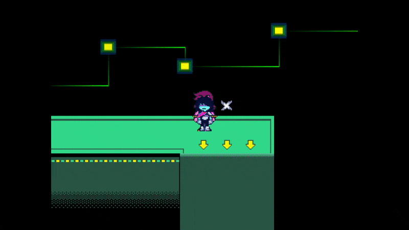

# `scr_keyiteminfo`
This is one giant code file that stores information regarding all the Dark World key items in the game.

If you want to add new/modify existing keyitems - `scr_keyiteminfo` is where you want to be.

# Item Indexes
Every item in DELTARUNE, whether it'd be a weapon, armor, item, light world item, or key item, all have their own predefined numeric index.

One thing that is common across *all* item registries is that index `0` is always reserved for nothing.

Here's a list of *some* keyitem indexes as an example.

- `1 (Cell Phone)`
- `2 (Egg)`
- `3 (Broken Cake)`

# Structure of a keyitem in `scr_keyiteminfo`

All keyitems have their own `case` in `scr_keyiteminfo`.
Each `case` is reserved for an item index. (Including `0`, which is nothing.)

All `case`s contain all the necessary keyitem information for an individual keyitem, Name, Description, etc... 

Here is a *(heavily commented)* code snippet of a keyitem (Cell Phone) in `scr_keyiteminfo`

*Code taken from Chapter 2*

```gml
// Keyitem index 1, which is reserved for Cell Phone.
case 1:
    // Key item description
    tempkeyitemdesc = stringsetloc("It can be used to make calls.", "scr_keyiteminfo_slash_scr_keyiteminfo_gml_13_0");
    // Key item name
    tempkeyitemname = stringsetloc("Cell Phone", "scr_keyiteminfo_slash_scr_keyiteminfo_gml_14_0");
    // If key item is usable directly in the menu
    tempkeyitemusable = true;
    // Break ends the case. Always keep it!
    break;
```

This code should explain *every* property of a keyitem. You can easily modify existing keyitems with this knowledge!

But what if... you wanted to make your own...?

# Adding a new keyitem
First, you must create a new case in `scr_keyiteminfo`. With a new index, too.

> [!WARNING]
> DO NOT make the index simply the next after the last index. Since DELTARUNE hasn't been fully made yet, that index *will* be used in a later release. Which may break your mod saves when you update it, or cause other issues.

```gml
// New keyitem index (they don't have to be in order)
case 25000:
    break;
```

Great, now we can add all the *keyitem information* described previously to our keyitem. Let's see an example.

> [!NOTE]
> This example doesn't use `stringsetloc` or other localization functions for simplicity.

```gml
case 25000:
    tempkeyitemname = "StarKey";
    tempkeyitemdesc = "Key of#            Starwalker";
    tempkeyitemusable = true;
    break;
```

Now, we need to actually *get* the item in our inventory in-game... You could either *edit the save file directly (which we will not be getting into)*

Or, you could just add a `scr_keyitemget(keyitem_index)` somewhere in the code (this will add the keyitem to your inventory). It can be added to the end of `scr_load` as a simple test (make sure to remove this when you're done!)

Doing that, then loading our SAVE...


*There it is!* There is our custom keyitem. Isn't it just cute?

> [!NOTE]
> If your keyitem isn't usable in the menu, you can stop here.

Now, to actually make it *do* stuff...

## Making the keyitem do stuff
You can make the keyitem actually *do* things by going to `scr_itemuse`.

Now, to add a case for your keyitem, you want to take *your keyitem case* (this is 25000 for me) and add **300** to it.

So that'd be...
```gml
case 25300:
    break;
```

Now, you can add code in the `case` that'll activate when using the item in the menu.

Here is an example of dialogue:

> [!NOTE]
> This example doesn't use `stringsetloc` or other localization functions for simplicity.

```gml
case 25300:
    scr_speaker("no_name");
    scr_keyitemremove(25000);
    snd_play(snd_hypnosis);
    msgset(0, "\\cW* This \\cYinventory\\cW is \\cYPissing\\cW me off./");
    msgnext("\\cW* I'm the original        \\cYStarKey\\cW/");
    msgnext("\\cW* (...?^1! The (original) \\cYStarKey\\cW vanished from your hand!)/");
    msgnext("* (How are you going to be original now...?)/%");
    scr_itemdialoguer();
    break;
```

And look! Now it works!!!

