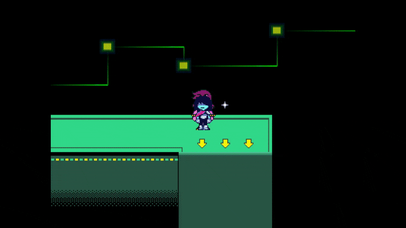

# `scr_weaponinfo`
This is one giant code file that stores information regarding all the Dark World weapons in the game.

If you want to add new/modify existing weapons - `scr_weaponinfo` is where you want to be.

# Item Indexes
Every item in DELTARUNE, whether it'd be a weapon, armor, or key item, all have their own predefined numeric index.

One thing that is common across *all* item registries is that index `0` is always reserved for nothing.

Here's a list of *some* weapon indexes as an example.

- `1 (Wood Blade)`
- `2 (Mane Ax)`
- `3 (Red Scarf)`

# Structure of a weapon in `scr_weaponinfo`

All weapons have their own `case` in `scr_weaponinfo`.
Each `case` is reserved for an item index. (Including `0`, which is nothing.)

All `case`s contain all the necessary weapon information for an individual weapon, ATK, DEF, MAG, Sell value, etc... 

Here is a *(heavily commented)* code snippet of a weapon (Wood Blade) in `scr_weaponinfo`

*Code taken from Chapter 2*

```gml
// Weapon index 1, which is reserved for Wood Blade.
case 1:
    // Name of the weapon
    weaponnametemp = stringsetloc("Wood Blade", "scr_weaponinfo_slash_scr_weaponinfo_gml_33_0");
    // Description of the weapon
    weapondesctemp = stringsetloc("A wooden practice blade with a carbon-#reinforced core.", "scr_weaponinfo_slash_scr_weaponinfo_gml_34_0");
    // Message if you try to equip on Susie
    wmessage2temp = stringsetloc("What's this!? A CHOPSTICK?", "scr_weaponinfo_slash_scr_weaponinfo_gml_35_0");
    
    // For Wood Blade, the Susie equip message changes 
    // after a certain story point in chapter 1.
    if (global.plot < 30 && global.chapter == 1)
        wmessage2tempt = stringsetloc("... You have a SWORD!?", "scr_weaponinfo_slash_scr_weaponinfo_gml_39_0");
    
    // Message if you try to equip on Ralsei
    wmessage3temp = stringsetloc("That's yours, Kris...", "scr_weaponinfo_slash_scr_weaponinfo_gml_40_0");
    // Message if you try to equip on Noelle
    wmessage4temp = stringsetloc("(It has bite marks...)", "scr_weaponinfo_slash_scr_weaponinfo_gml_42_0");
    // Weapon ATK
    weaponattemp = 0;
    // Weapon DEF
    weapondftemp = 0;
    // Weapon MAG
    weaponmagtemp = 0;
    // Unused, this would've increased the amount of attack bolts while 
    // using the weapon, similiar to the Burnt Pan in UNDERTALE.
    weaponboltstemp = 1;
    // Unused, Unknown purpose.
    weaponstyletemp = "?";
    // Unused, would've increased TP from grazing if implemented.
    weapongrazeamttemp = 0;
    // Unused, would've increased Graze Size if implemented.
    weapongrazesizetemp = 0;
    // If Kris can equip the weapon
    weaponchar1temp = 1;
    // If Ralsei can equip the weapon
    weaponchar2temp = 0;
    // If Susie can equip the weapon
    weaponchar3temp = 0;
    // NOTE: not in the original chapter2 code, but you can define 
    // if Noelle can equip the weapon like this
    // weaponchar4temp = 0;
    // This is an image_index value for spr_dmenu_items, which is for the icon 
    // of the weapon. Remember that image_index values start at zero!
    weaponicontemp = 1;
    // Also an image_index value for spr_dmenu_items, 
    // however it determines the weapon's ability icon.
    weaponabilityicontemp = 0;
    // Display text for the weapon ability
    // a string with a single space " " means no ability.
    weaponabilitytemp = " ";
    // Sell value of the weapon
    value = 60;
    // Break ends the case. Always include this!
    break;
```

This code should explain *every* property of a weapon. You can easily modify existing weapons with this knowledge!

But what if... you wanted to make your own...?

# Adding a new weapon
First, you must create a new case in `scr_weaponinfo`. With a new index, too.

> [!WARNING]
> DO NOT make the index simply the next after the last index. Since DELTARUNE hasn't been fully made yet, that index *will* be used in a later release. Which may break your mod saves when you update it, or cause other issues.

```gml
// New weapon index (they don't have to be in order)
case 25000:
    break;
```

Great, now we can add all the *weapon information* described previously to our weapon. Let's see an example.

> [!NOTE]
> This example doesn't use `stringsetloc` or other localization functions for simplicity.

```gml
case 25000:
    weaponnametemp = "Star Blade";
    weapondesctemp = "Blade of#       Starwalker";
    wmessage2temp = "Damn, seems original...";
    
    wmessage3temp = "It's sparkly!";
    wmessage4temp = "Stop poking me!";
    // High DEF, low ATK weapon.
    weaponattemp = -2;
    weapondftemp = 3;
    weaponmagtemp = 0;
    weaponboltstemp = 1;
    weaponstyletemp = "?";
    weapongrazeamttemp = 0;
    weapongrazesizetemp = 0;
    weaponchar1temp = 1;
    weaponchar2temp = 0;
    weaponchar3temp = 0;
    weaponchar4temp = 0;
    weaponicontemp = 1;
    weaponabilityicontemp = 7;
    weaponabilitytemp = "Originality";
    value = 400;
    break;
```

Now, we need to actually *get* the item in our inventory in-game... You could either *edit the save file directly (which we will not be getting into)*

Or, you could just add a `scr_weaponget(weapon_index)` somewhere in the code (this will add the weapon to your inventory). It can be added to the end of `scr_load` as a simple test (make sure to remove this when you're done!)

Doing that, then loading our SAVE...



*There it is!* There is our custom weapon. Isn't it just cute?